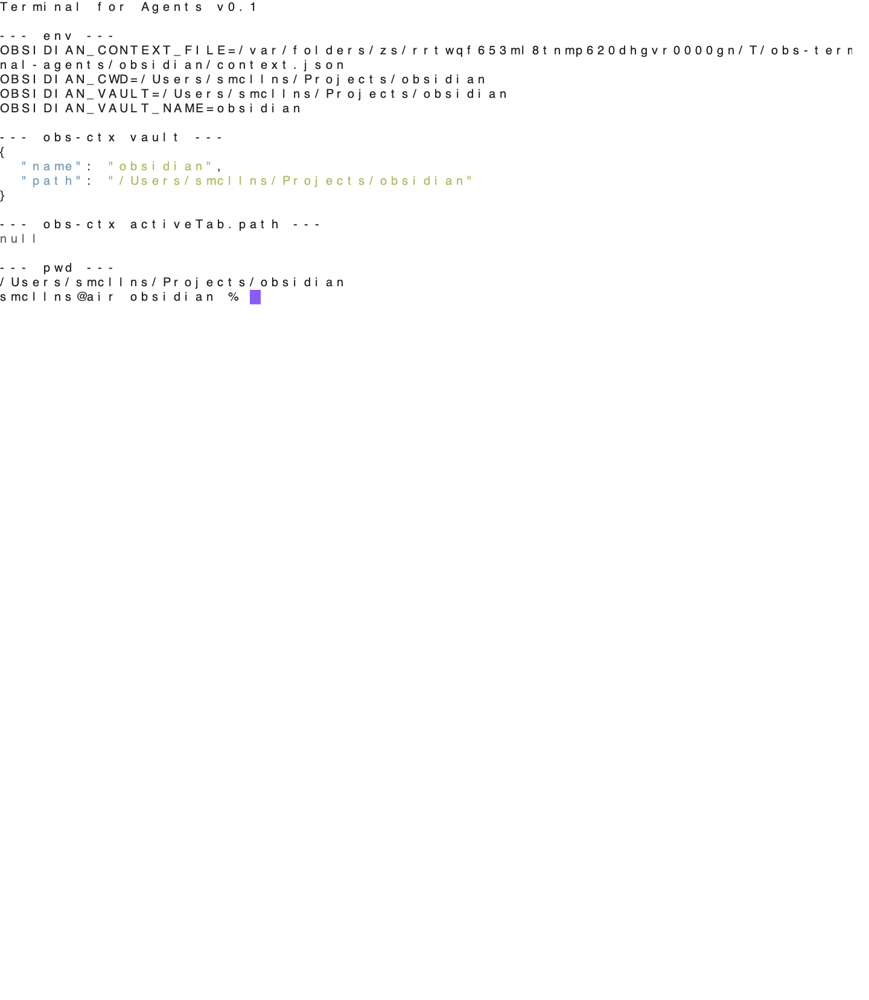

# Terminal for Agents

An Obsidian plugin that opens a real Ghostty terminal pane inside your vault — and gives the agent running in that shell live awareness of what you're looking at in Obsidian.



---

## Why this exists

The state of the art in agent workflows is a terminal next to your editor. If your editor is Obsidian (notes-first, no built-in terminal, no native LSP), you currently solve that by stacking your tmux session beside Obsidian and tab-switching.

That stack has two problems:

1. **The terminal lives in a separate window.** It's not pinned to the vault you're working on. Closing/reopening Obsidian or switching desktops desyncs the two.
2. **The agent in that terminal doesn't know what you're reading.** You're staring at a note about Q2 planning and asking Claude Code for help, but Claude doesn't know which note you're looking at. You either paste the path manually every time, or the agent operates without that context.

This plugin solves both. The terminal lives inside Obsidian as a pinned pane. The agent in that terminal gets a live JSON snapshot of your workspace state (active tab, open tabs, vault path) plus an `obs-ctx` shell function to query it. No copy-paste, no manual context.

## Who it's for

You, if all of these are true:

- You use Obsidian as a primary work surface (notes, planning, knowledge).
- You run agents from a terminal (Claude Code, codex, aider, etc.) — not just from IDE plugins.
- You want the agent to know what you're looking at, automatically.

Not for you if:

- You don't run agents from a shell at all.
- You're on Windows. (v1 is macOS/Linux only — see [Roadmap](#roadmap).)

## How it works in 30 seconds

```
┌─ Obsidian ─────────────────────────────────────────────┐
│                                                        │
│  Your notes pane            │  Terminal for Agents     │
│  (active.md is here)        │  ┌───────────────────┐   │
│                             │  │ smcllns@air ~ %   │   │
│                             │  │ claude            │   │
│                             │  │ > help me edit ...│   │
│                             │  └───────────────────┘   │
│                                       │                │
│        workspace events ──────────────┤                │
│                                       ▼                │
│                              context.json (atomic)     │
│                              OBSIDIAN_* env vars       │
│                              obs-ctx shell function    │
│                                                        │
└────────────────────────────────────────────────────────┘
```

The plugin:

1. Renders a real Ghostty VT in an Obsidian pane (via `ghostty-web` WASM). Not xterm.js — real Ghostty parser, Unicode-correct, OSC 8 hyperlinks, etc.
2. Spawns your `$SHELL` through a tiny Bun-based PTY helper (~50 lines). No `node-pty`, no `electron-rebuild`.
3. Subscribes to Obsidian's `active-leaf-change` and `layout-change`. On any change it atomically writes the active tab + open tabs to a JSON file (~100ms debounced).
4. Sets `OBSIDIAN_VAULT`, `OBSIDIAN_VAULT_NAME`, `OBSIDIAN_CONTEXT_FILE` in the shell environment, and sources a one-line `obs-ctx` shell function so the agent can read the JSON with a single command.
5. For Claude Code specifically, it wraps `claude` with an `--append-system-prompt` that tells Claude where the vault is and where to find the context file. Claude reads it as needed.

## Install

**Requires:** Obsidian 1.7.2+, macOS or Linux, [Bun](https://bun.sh) installed locally (the PTY helper runs on it).

### Option A — BRAT (recommended for early users)

1. Install the [BRAT](https://github.com/TfTHacker/obsidian42-brat) community plugin
2. BRAT settings → **Add Beta Plugin** → `https://github.com/yolo-sam/obsidian-terminal-agents`
3. Settings → Community plugins → enable **Terminal for Agents**

### Option B — Manual

Download the latest release assets (`main.js`, `manifest.json`, `helper.ts`, `shellrc.sh`, `styles.css`) into `<vault>/.obsidian/plugins/obsidian-terminal-agents/` and enable from Settings → Community plugins.

## Quick start

1. Open the command palette → **Open terminal**. (Or click the terminal ribbon icon.)
2. The pane spawns your `$SHELL` with the vault as the working directory.
3. Try:

   ```sh
   obs-ctx                       # full context JSON
   obs-ctx .activeTab.path       # just the path of the open note
   obs-ctx .openTabs[].path      # paths of every open tab
   echo "$OBSIDIAN_VAULT"        # absolute vault path
   ```

4. Run `claude` — it'll know which vault you're in and where to read live context.

## Settings (4 knobs)

| Setting | Default | What it does |
|---|---|---|
| **Default shell** | `$SHELL` | Absolute path of the shell to spawn. |
| **Font size** | `13` | Terminal font size in pixels. |
| **Agent scope** | Vault root | Where the shell opens (vault root / active note's folder / custom path). Agents inherit this as `cwd`. |
| **Share Obsidian context with terminal** | ON | When ON: writes the JSON file, sets `OBSIDIAN_*` env vars, sources `obs-ctx` + wraps `claude`. Toggle OFF for a plain terminal. |

## How the agent gets context

When the toggle is ON, the plugin gives the spawned shell three things:

**1. Environment variables** (so any agent can read them, no plugin-specific knowledge needed):

```
OBSIDIAN_VAULT=/absolute/path/to/vault
OBSIDIAN_VAULT_NAME=Vault Display Name
OBSIDIAN_CONTEXT_FILE=/tmp/.../context.json
OBSIDIAN_CWD=/absolute/path/where/the/shell/opened
```

**2. A live JSON snapshot** at `$OBSIDIAN_CONTEXT_FILE`, atomic-written on every workspace event:

```json
{
  "updatedAt": 1779260123,
  "vault": { "name": "Vault", "path": "/Users/sam/vault" },
  "activeTab": { "leafId": "abc", "path": "notes/foo.md", "type": "markdown", "title": "Foo", "isActive": true, "isPinned": false },
  "openTabs": [
    { "leafId": "abc", "path": "notes/foo.md", ... },
    { "leafId": "def", "path": "ref/x.html", ... }
  ]
}
```

**3. A shell helper** (`obs-ctx`) wired into bash/zsh:

```sh
obs-ctx                    # full JSON, via jq if available
obs-ctx .activeTab         # just the active tab object
obs-ctx '.openTabs[].path' # quote-paths for zsh's pattern matching
```

**4. A `claude` wrapper** that injects an `--append-system-prompt` so Claude Code knows the vault and context-file paths without needing any plugin awareness. Other agents (codex, aider, …) read the env vars themselves.

## Architecture

```
┌─ main.js (TypeScript, runs in Obsidian renderer) ─┐
│                                                   │
│   TerminalAgentsPlugin                            │
│   ├── ItemView                                    │
│   │   ├── ghostty-web Terminal (canvas render)    │
│   │   ├── spawn() → bun helper.ts → /bin/zsh      │
│   │   └── ResizeObserver → fd 3 → terminal.resize │
│   │                                               │
│   └── ContextBridge                               │
│       ├── workspace events (active-leaf, layout)  │
│       └── atomic JSON write (debounced 100ms)     │
│                                                   │
└───────────────────────────────────────────────────┘

helper.ts (Bun, runs as child of plugin)
├── Bun.spawn({ terminal: { … } })  ← Bun's native PTY
├── stdin pipe → terminal.write
├── terminal.data → stdout pipe
└── fd 3 → 4-byte uint16 frames → terminal.resize
```

**Why Bun for the PTY:** Bun 1.3+ has a built-in PTY via `Bun.spawn({ terminal: … })`. No native addons, no `electron-rebuild`, no `node-pty` (which has historically broken on every Electron upgrade). The helper is ~50 lines. If you already use Bun for anything, you have zero new dependencies.

**Why Ghostty over xterm.js:** ghostty-web is the same `libghostty-vt` parser that powers the native Ghostty app, compiled to WASM. Correct Unicode (grapheme clusters, wide chars), OSC 8 hyperlinks, Kitty graphics protocol, modern keyboard protocol — all things xterm.js partially supports and Ghostty just does. The WASM is ~700KB, inlined into `main.js`.

## Roadmap

v1 ships intentionally small. Likely next iterations, in rough priority order:

- **Windows support** — currently macOS/Linux only; Bun's PTY is POSIX-only and we'd need a different path on Windows.
- **MCP server transport** — instead of a JSON snapshot file, expose context as an MCP server inside the plugin. Agents like Claude Code subscribe and get live notifications + bidirectional ops (focus this tab, open this file). Removes the polling cost.
- **Per-leaf terminals** — multiple terminal panes, each scoped to its own context (e.g. one per active note, vs. one global).
- **Selection + cursor position in context** — for "edit this paragraph"-style requests.
- **Path allowlist/denylist** — finer-grained agent scope than just cwd.

See [`HANDOFF.md`](HANDOFF.md) for the full design rationale and what we'd build next if we had another day.

## Development

```sh
git clone https://github.com/yolo-sam/obsidian-terminal-agents
cd obsidian-terminal-agents
bun install
bun run build          # writes main.js
bun run dev            # watch mode
```

Sideload into a test vault:

```sh
mkdir -p <vault>/.obsidian/plugins/obsidian-terminal-agents
cp main.js manifest.json styles.css helper.ts shellrc.sh \
   <vault>/.obsidian/plugins/obsidian-terminal-agents/
```

Then in Obsidian: Settings → Community plugins → Reload → enable.

## Credits

Forks and substantially rewrites [`lavs9/obsidian-ghostty-terminal`](https://github.com/lavs9/obsidian-ghostty-terminal). What's different: Bun PTY helper instead of Python; no Ghostty config parsing (use Obsidian CSS vars instead); no multi-pane / file-explorer menu; no node-pty; live workspace context bridge for agents — the whole reason this exists.

`ghostty-web` is by [@ghostty-org](https://github.com/ghostty-org/ghostty).

## License

MIT.
